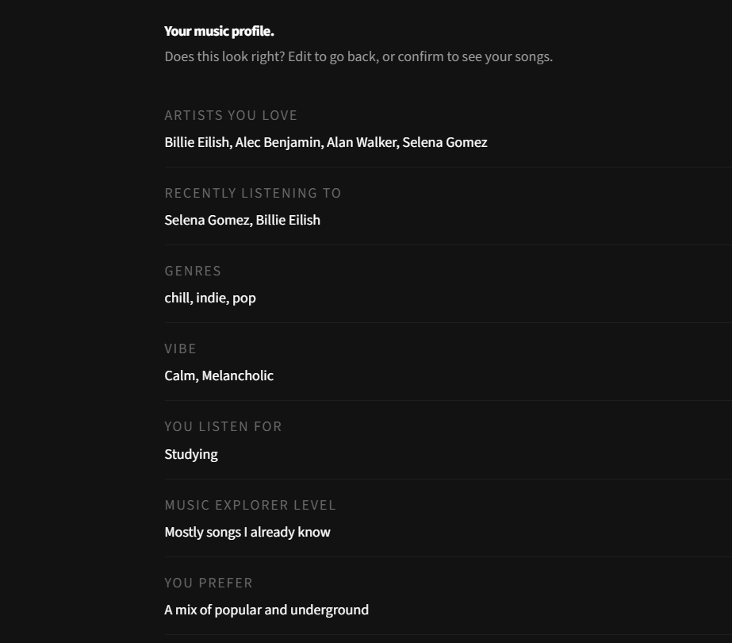
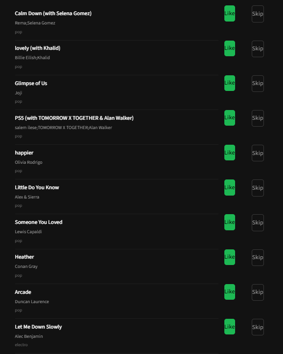
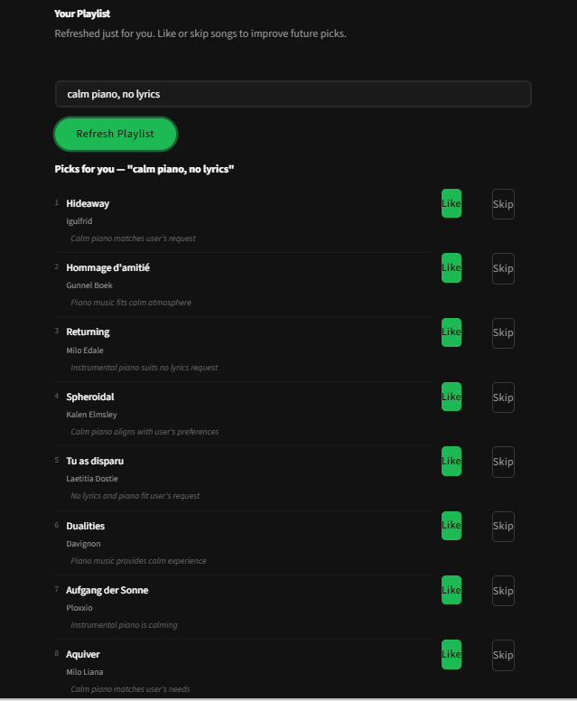
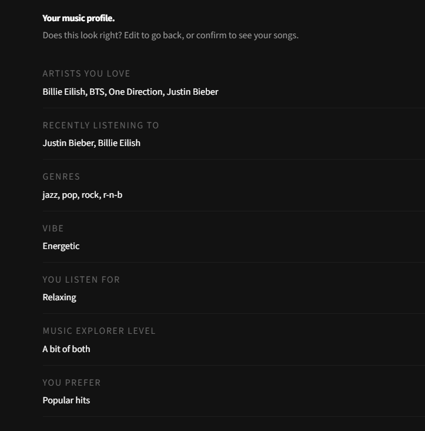
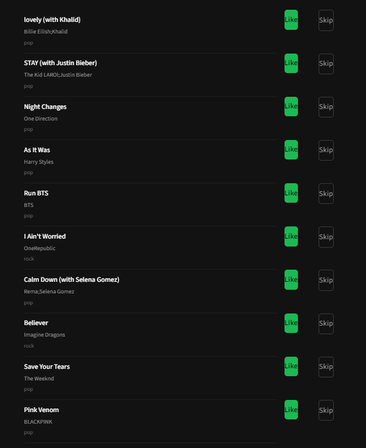
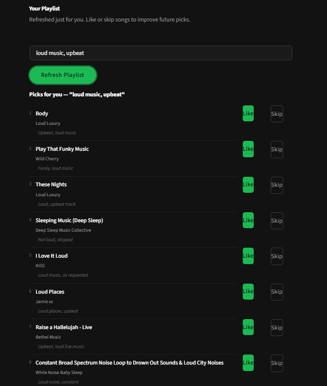
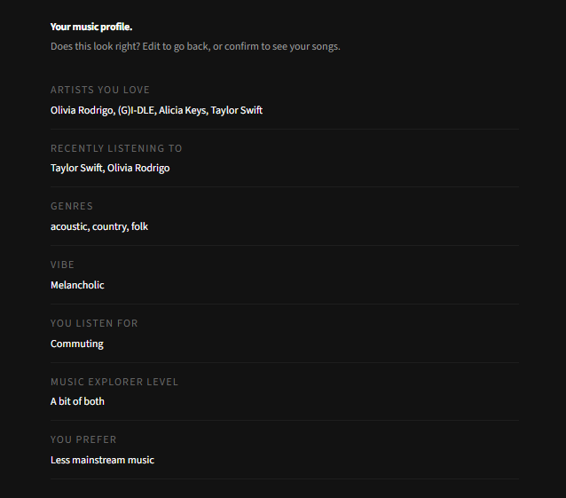
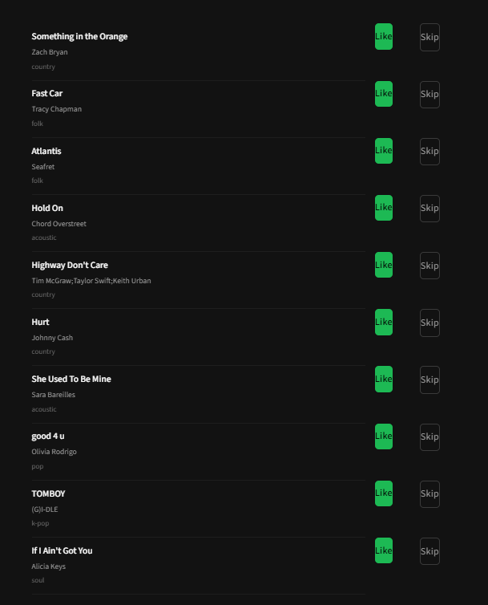
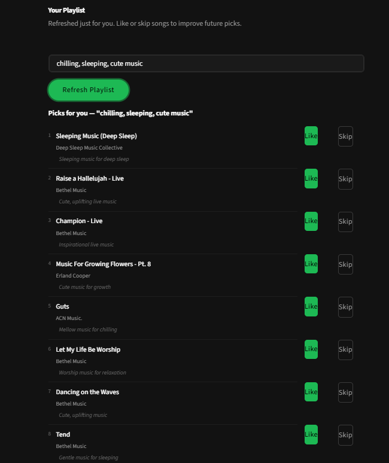

# Applied AI Music Recommendation System

A three-stage AI pipeline that learns your musical taste, searches 81,343 songs
by free-text intent, and delivers a personalised playlist with per-song explanations
written by a language model.

---

## Original Project (Modules 1–3)

The foundation of this project was a **CLI-first content-based music recommender**
built in Modules 3. It compared each song in a small, hand-crafted catalog against
a fixed user profile by computing a weighted score across seven audio features —
energy, tempo, valence, danceability, acousticness, genre, and mood — then returned
the top-K matches with short explanations. The original system had no learning, no
user history, no external API, and no retrieval step: it simply scored every song
against a static profile and ranked the results.

---

## What This Project Does and Why It Matters

This upgraded system addresses the two biggest limitations of the original:
it learns from actual user behavior (likes and skips), and it understands
free-text requests like *"late night jazz piano, no lyrics"* rather than relying
on fixed profile fields.

Three AI components work in sequence:

| Stage | Technology | What it does |
|---|---|---|
| Retrieval | TF-IDF search (scikit-learn) | Searches 81k song descriptions for the words in your request |
| Ranking | LightGBM ML model | Scores retrieved songs against your personal listening history |
| Reasoning | Groq LLM (Llama-3.3-70b) | Writes one sentence per song explaining why it fits your request |

This mirrors how real production recommendation systems (Spotify, YouTube) work:
cheap retrieval finds candidates, a trained ML model personalises them, and a
language model adds natural-language context.

---

## Architecture Overview


The system has two entry points:

**New user** → `streamlit run src/profile/survey.py`
Goes through an 8-question survey, rates 10 cold-start songs (Like/Skip), then
lands on the playlist view automatically.

**Returning user** → `streamlit run src/main.py`
Loads the saved profile directly and opens the playlist view.

In the playlist view, the user types an optional free-text intent and clicks
**Refresh Playlist**. This triggers:

1. **TF-IDF search** (`rag_layer.py`) — the intent is converted to a TF-IDF
   vector and dot-producted against the pre-built index of 81,343 song descriptions
   to retrieve the 100 most relevant songs.
2. **ML Ranking** (`ranker.py` + `features.py`) — 6 features are computed per
   candidate (content similarity, artist similarity, freshness, popularity,
   collaborative score, diversity penalty) and scored by a LightGBM model trained
   on `interactions.csv`.
3. **Groq LLM** (`rag_layer.py`) — the top 50 ranked songs and the user's intent
   are sent to Groq, which selects the final 10 and writes one explanatory sentence
   per song.

If the user types no intent, the TF-IDF step is replaced by a profile-based
retriever (`retriever.py`) that uses cosine similarity over PCA audio embeddings.
If Groq fails, the ML ranking stands and songs are shown without explanations.

---

## Setup Instructions

### Prerequisites

- Python 3.10 or later
- A free Groq API key — get one at [console.groq.com](https://console.groq.com)

> **MSYS2 / MINGW Python users:** install scikit-learn via the MSYS2 package
> manager instead of pip (pip cannot compile it without a Fortran toolchain):
> ```bash
> C:\msys64\usr\bin\pacman.exe -S mingw-w64-ucrt-x86_64-python-scikit-learn
> python -m venv .venv --system-site-packages --clear
> ```

### Step 1 — Clone and set up the environment

```bash
git clone <repo-url>
cd applied-ai-music-recommendation-system
python -m venv .venv
source .venv/bin/activate      # Mac / Linux
.venv\Scripts\Activate.ps1     # Windows PowerShell
pip install -r requirements.txt
```

### Step 2 — Add your Groq API key

```bash
cp .env.example .env
# Open .env and add:  GROQ_API_KEY=your_key_here
```

### Step 3 — Pre-compute audio embeddings (one time, ~2 minutes)

```bash
python src/embeddings/precompute.py
```

Reads all 81,343 songs, runs PCA on 10 audio features, and saves
`embeddings/song_embeddings.npy` and `embeddings/artist_embeddings.npy`.

### Step 4 — Build the RAG knowledge base (one time, ~30 seconds)

```bash
python src/rag/build_knowledge_base.py
```

Generates a text description for every song from its audio features, fits a
TF-IDF vectorizer on all 81k descriptions, and saves the search index to
`embeddings/knowledge_base_tfidf.npz`.

### Step 5 — Run the app

**New user (complete the survey first):**
```bash
streamlit run src/profile/survey.py
```

**Returning user:**
```bash
streamlit run src/main.py
```

---

## Sample Interactions

### Walkthrough Video

<!-- Replace the URL below with your video link (YouTube, Loom, etc.) -->
> **Demo video:** [Watch the full walkthrough](https://www.loom.com/share/3f3579b4fb6f4dfa9828460adcfb8a17)

---

### Landing page

The survey opens on a clean onboarding screen. A new user works through
8 questions about their favourite artists, genres, mood, and listening purpose.


---

### Interaction 1 — Discovering new music with a vague intent

**Input:** the user types a broad mood-based request.



**Output:** the system retrieves songs that match the mood keywords, ranks them
against the user's liked history, and Groq writes why each one fits.



**AI-generated explanations:**



---

### Interaction 2 — Specific context request

**Input:** the user gives a detailed contextual request with multiple constraints.



**Output:** TF-IDF narrows the catalog to songs whose descriptions match the
keywords; the ranker re-orders them by personal taste.



**AI-generated explanations:**



---

### Interaction 3 — Artist-style request

**Input:** the user asks for something similar to a specific artist's style.



**Output:** the system surfaces songs from similar artists and acoustic profiles,
validated against the user's interaction history.



**AI-generated explanations:**



---

## Design Decisions

### Three stages instead of one LLM call

Sending "recommend 10 calm jazz songs" directly to a language model fails for two
reasons: the LLM has never seen the specific 81k songs in this catalog, and it has
no idea what this particular user has liked or skipped. The three-stage design gives
each component the job it handles best: TF-IDF for fast keyword search over the
full catalog, LightGBM for personal taste scoring, and Groq only for natural-language
explanation.

### TF-IDF instead of dense embeddings

The original design used Google Gemini's embedding API, which hit 429 rate-limit
errors on the free tier when trying to embed 81k songs. TF-IDF builds in 30 seconds
locally with no API calls, no cost, and no rate limits. For the kinds of queries
users actually type ("jazz piano", "no lyrics", "studying"), keyword matching is
competitive with dense embeddings and considerably simpler.

### PCA on audio features instead of a pre-trained audio model

PCA on 10 audio features (energy, tempo, valence, danceability, etc.) captures the
dimensions that matter for this project: how intense a song is, how happy it sounds,
how vocal it is. Pre-trained audio models (e.g. Jukebox) require a GPU and produce
embeddings that are harder to inspect or debug. PCA is fast, interpretable, and good
enough for taste-matching at this scale.

### LightGBM for ranking

A neural ranking model would need GPU training time and larger datasets. LightGBM
trains in minutes on CPU, handles non-linear interactions between features (e.g.
"high content similarity AND low diversity penalty" predicts a like better than
either alone), and produces a calibrated probability that the user will like each
song. A hand-weighted fallback formula keeps the pipeline working locally where
LightGBM cannot be installed.

### Groq's role is explanation only, not re-ranking

The ML model already ranked the songs by learned personal taste. Asking Groq to
also re-rank them would be unreliable — LLMs are not better than trained models at
predicting which specific audio features a user prefers. Groq's task is narrowed to
writing one sentence per song that cites the user's own words. Narrower task =
more consistent output = lower token cost.

---

## Testing Summary

### What worked

- The TF-IDF retrieval correctly returns songs matching specific keywords. Queries
  like `"no lyrics instrumental"` reliably surface songs with high `instrumentalness`
  scores, because those words are explicitly included in generated descriptions.
- The LightGBM fallback (hand-weighted formula) produces sensible rankings even
  without the trained model — the pipeline never crashes due to a missing file.
- The Groq explanation step handles retry logic correctly. Tested by temporarily
  using an invalid key: the system returned ML-ranked songs with empty explanations
  rather than throwing an error.
- The freshness window relaxation worked as expected: when the primary 90-day window
  returned too few songs from the dataset, the system automatically widened to 180,
  then 365, then all songs.

### What was harder than expected

- **Package installation on MINGW Python** was the biggest practical challenge.
  `scipy`, `pandas`, `faiss-cpu`, and `lightgbm` all require native compilation
  that fails without MSVC. Each had to be either worked around (custom CSR dot
  product in place of scipy, `List[Dict]` in place of pandas DataFrames, numpy
  dot product in place of FAISS) or delegated to Google Colab (LightGBM training).
- **Rate limits on the Gemini embedding API** blocked the original RAG design and
  forced a switch to TF-IDF. This turned out to be a better decision: TF-IDF is
  faster, free, and requires no network call.

### What I would do differently

- Collect more interaction data before training the ranking model. With only 16
  simulated users and ~1000 interactions, the model has limited signal to learn from.
- Add a feedback loop that re-trains the model incrementally as new likes arrive,
  rather than requiring a full Colab run.

---

## Reflection

Building this project changed how I think about AI systems. The original project
felt like a calculator: you put numbers in, apply weights, and get numbers out.
This version feels like a system that has opinions — because it learns them from
your behavior.

The most important concept I took away is that **RAG is about scoping, not replacing
knowledge**. The LLM (Groq) is not smarter because we gave it our song catalog —
it is smarter because we reduced 81,343 possibilities to the 50 most relevant ones
*before* it had to reason. The intelligence lives in the pipeline, not just in the model.

I also learned that building an AI system is mostly engineering decisions: what data
to collect, how to represent it, where each component's responsibility ends. The
three-stage Retrieve → Rank → Reason split was the single most important structural
choice, and it made every subsequent decision easier because each component had a
clear, testable job.

The hardest moment was when Gemini's embedding API failed due to rate limits — the
whole retrieval approach had to change overnight. That forced me to understand TF-IDF
deeply enough to re-implement it without scipy, which taught me more about how
information retrieval actually works than any tutorial would have.
